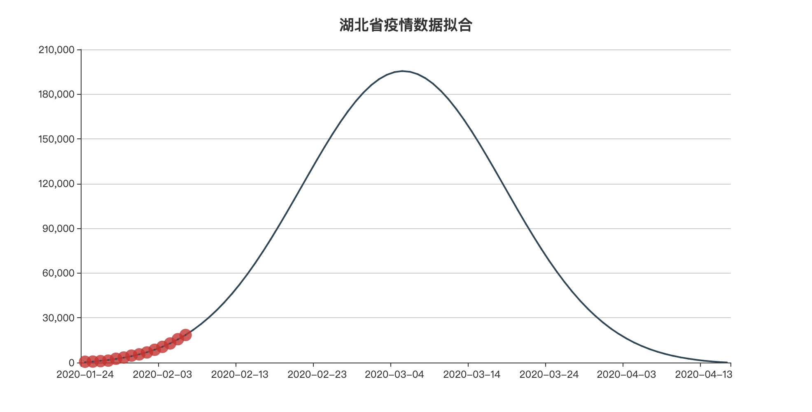
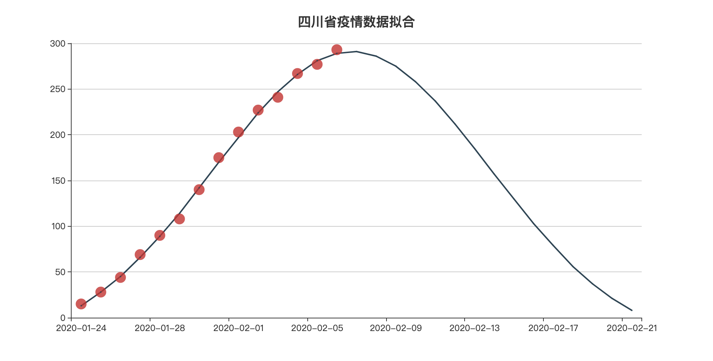

# 通过高斯分布拟合ncov_2019肺炎疫情数据

### 数据来源：
[DXY-2019-nCoV-Data项目](https://github.com/BlankerL/DXY-2019-nCoV-Data)

### 拟合方式
通过高斯分布拟合当前疫情人数数据（各省当天人数=累计确诊人数-死亡人数-治愈人数）

### 部署方式
本项目通过FLASK作为web端， 前端echarts实现可视化。

### 申明：
本项目不严肃不严谨不牟利，仅仅是从数据角度来拟合当前数据，未考虑到其他因素如特效药和国家加大防控力度后的情况。一定存在很大的偏差，且不保证各省市都能得到较好的拟合。

### 对部分省市的拟合情况如下：
1. 湖北省
    
2. 四川省
    